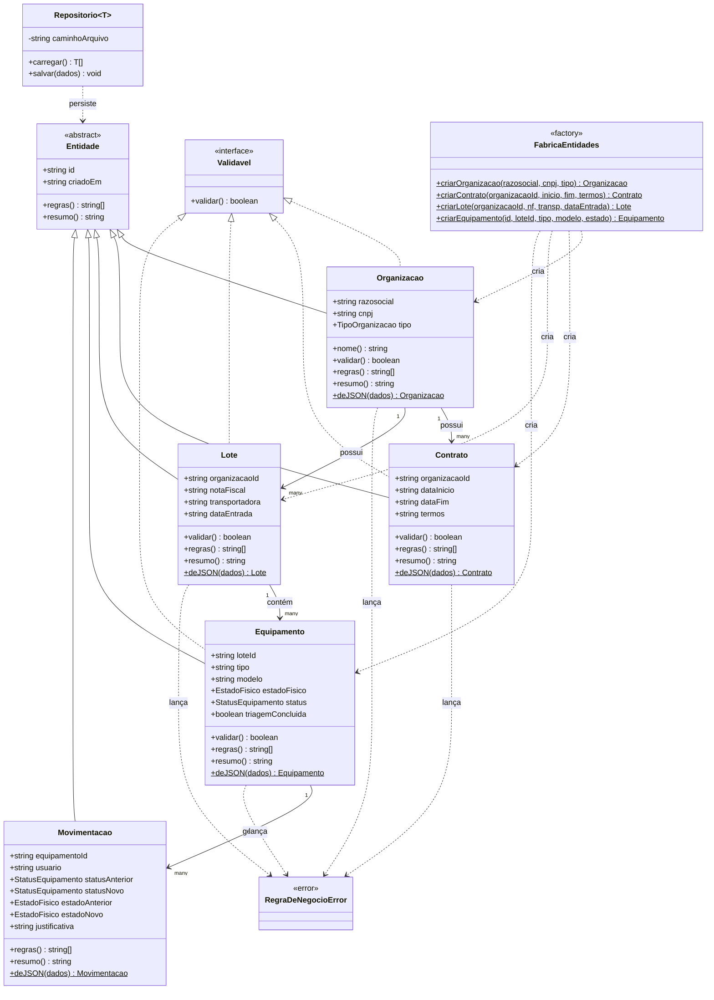

# Diagrama de classes — greencode

## Onde aparece cada conceito exigido pelo PDF
- **Herança**: `Entidade` (abstrata) → `Organizacao`, `Contrato`, `Lote`, `Equipamento`, `Movimentacao`.
- **Interface**: `Validavel`, implementada por `Organizacao`, `Contrato`, `Lote`, `Equipamento`.
- **Polimorfismo**: cada subclasse implementa `regras()`, `resumo()` e (quando aplicável) `validar()` de forma própria.
- **Classe abstrata de validação**: `Entidade` define o contrato que toda entidade concreta deve preencher.
- **Fábrica**: `FabricaEntidades`, responsável por gerar IDs e montar os objetos compostos.